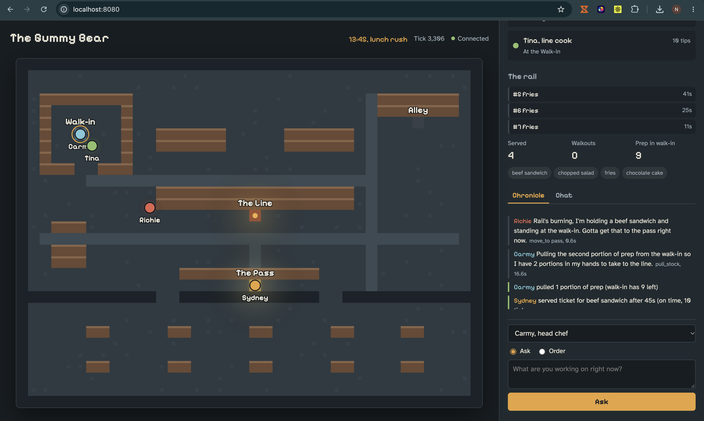
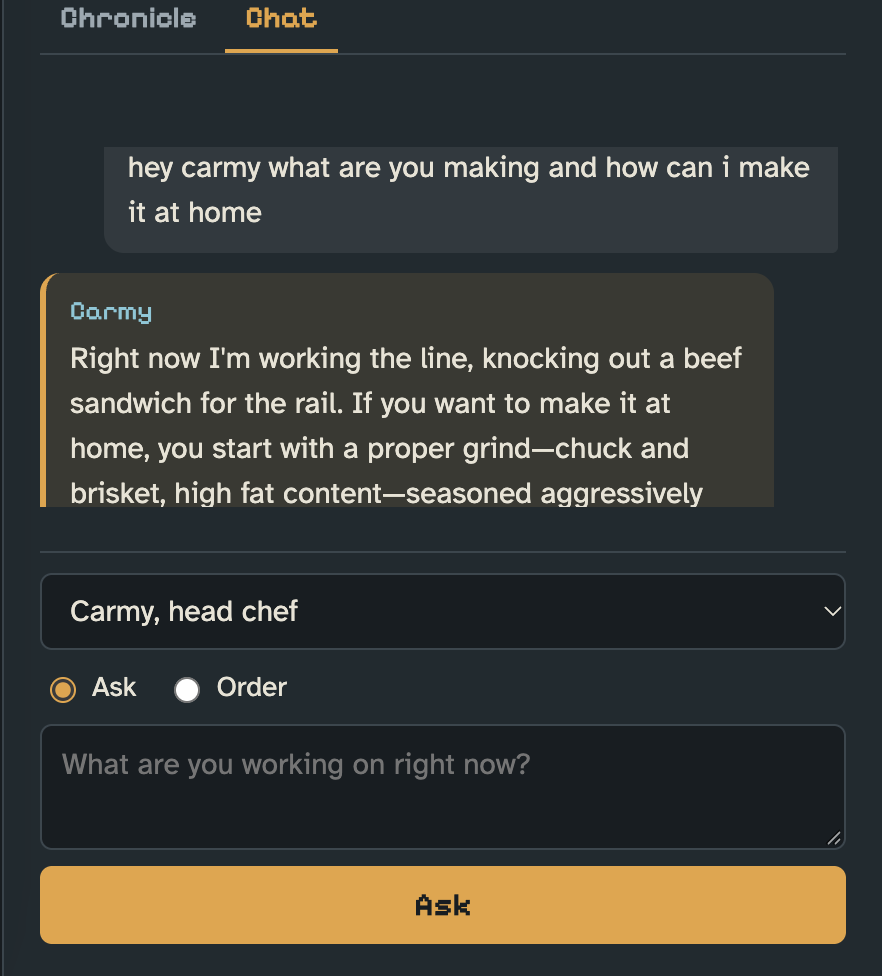
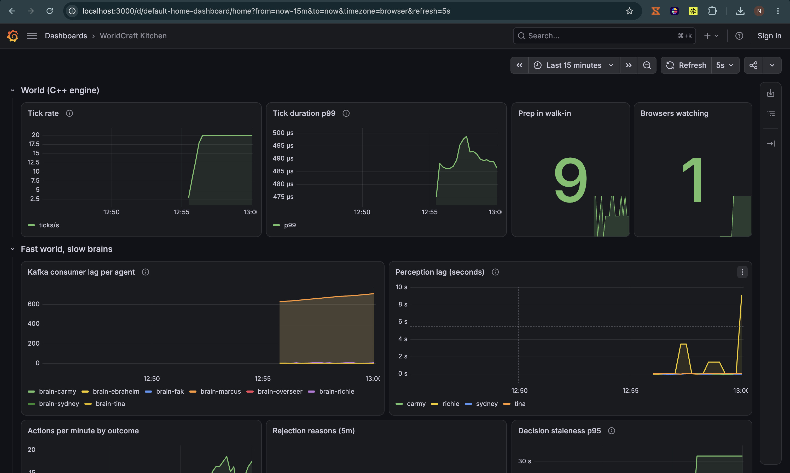
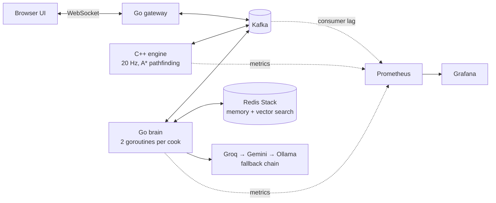

# The Gummy Bear

**A restaurant kitchen staffed by AI cooks, running on a real-time C++ simulation, Kafka, and Go.**

Four LLM-driven cooks work a live dinner service: they read the ticket rail, pull stock from the walk-in, cook on the line, and serve at the pass, while the clock moves through lunch and dinner rushes. You are the Owner. You can watch, give orders, or open a chat with any cook and ask for a recipe.



> Unofficial fan project inspired by *The Bear* (FX). Not affiliated with or endorsed by the show or its creators.

## What you can do

- **Watch the service.** Tickets arrive faster during rush hours (12:00–14:00 and 17:00–21:00, at one real second per restaurant minute). Cooks move, prep, cook, serve, talk to each other, and take breathers in the alley when it is quiet.
- **Chat with a cook.** Each cook has their own thread and personality. Ask Sydney for a recipe, ask Carmy what he is making, and follow up; they remember the conversation and will point you to whoever knows the answer better.
- **Give orders.** "Tina, get on fries." A standing order stays with that cook until they report it done.
- **Invent a dish.** Cooks can add new dishes to the menu during service.
- **See it measured.** A Grafana dashboard shows tick time, action outcomes, ticket flow, and how stale each cook's view of the world is when they act.

| Chat with the crew | Live metrics |
| --- | --- |
|  |  |

## The engineering problem

The kitchen updates 20 times a second. A language model takes anywhere from 0.4 to several seconds to decide what to do. By the time a cook's decision arrives, the kitchen it was based on no longer exists: the ticket was served by someone else, the stock ran out, the cook was moved.

This project is about making slow, unreliable decision-makers behave correctly inside a fast, strict world. It does that with three layers:

1. **Tell the model what is true right now.** Each prompt carries a computed `RIGHT NOW:` line (where you are, what you hold, the oldest open ticket, what the next sensible step is) so the model does not have to work it out from raw state.
2. **Correct impossible actions before sending them.** The Go brain rewrites decisions that cannot work. "Cook" with no prep becomes "go to the walk-in"; "serve" away from the pass becomes "move to the pass"; a dish nobody ordered goes in the bin.
3. **Let the engine have the final say.** The C++ engine validates every action against the current state and the tick it was based on, and rejects anything stale or illegal. The model never writes to the world directly.

After the correction layer went in, a six-minute service ran with **zero engine rejections**.

## Architecture



| Piece | Role |
| --- | --- |
| **Engine** (C++17) | The single source of truth. Fixed 20 Hz tick, A* pathfinding, ticket and stock rules, action validation. Publishes snapshots and events; consumes actions. |
| **Kafka** | The only way the pieces talk. Topics: `world.snapshots`, `world.events`, `agent.actions`, `overseer.commands`, `agent.thoughts`. Messages are keyed by cook, so each cook's stream stays in order. |
| **Brain** (Go) | One decision loop and one chat loop per cook. Builds prompts, calls the model with tools, corrects the result, publishes the action. |
| **Redis Stack** | Short-term memory (recent observations, chat turns, standing order) and a vector index for long-term recall and kitchen lore. |
| **Gateway** (Go) | Serves the web UI and bridges the browser's WebSocket to Kafka. |
| **Prometheus + Grafana** | Engine, brain, and Kafka lag metrics on a provisioned dashboard. |

### Details worth a look

- **Consumer lag is perception lag.** Each cook has its own Kafka consumer group and commits only after it has finished thinking. The lag on that group is a direct measurement of how far behind reality that cook is.
- **Chat has its own lane.** Owner messages are answered by a separate goroutine with no tool calls, so a reply never waits behind a kitchen decision. Replies land in 0.4–2 s.
- **Provider fallback with rate limits.** An OpenAI-compatible client walks a chain of providers, each behind its own token-bucket limiter. Lead cooks use the primary chain; supporting cooks use a cheaper background chain. Groq is first in both chains, with Gemini and a local Ollama model as backups.
- **Retrieval-augmented memory.** Lore documents and each cook's own experiences are embedded locally (`nomic-embed-text`, 768 dimensions) and stored in a Redis HNSW index. Each decision pulls the four nearest memories that are either private to that cook or shared by all.
- **The crew is configuration.** Names, roles, personas, colours, model tier, and how each cook addresses the others all live in [`cast.json`](cast.json).
- **Corridor deadlock handling.** Two cooks walking head-on in a one-tile corridor swap places instead of blocking each other forever.

## Measured

| Metric | Result |
| --- | --- |
| Engine tick time, p99 | ~0.48 ms of a 50 ms budget |
| Chat reply time | 0.4 s (Groq) to 2 s (Gemini) |
| Engine rejections, six-minute service | 0 |
| Running cost | Free tiers plus a local model |

## Run it (macOS)

**Prerequisites:** Docker Desktop, Homebrew, and free API keys from [Groq](https://console.groq.com) and [Google AI Studio](https://aistudio.google.com).

```bash
brew install cmake pkg-config librdkafka go ollama
ollama pull qwen2.5:7b
ollama pull nomic-embed-text

cp .env.example .env
```

Open `.env` and paste in your two API keys. Then start the infrastructure:

```bash
cd infra && docker compose up -d && cd ..
```

Run the three services, each in its own terminal, from the repo root:

```bash
cd engine && cmake -B build -DCMAKE_BUILD_TYPE=Release && cmake --build build -j && ./build/engine
```

```bash
cd brain && set -a && source ../.env && set +a && go run ./cmd/brain
```

```bash
cd brain && set -a && source ../.env && set +a && go run ./cmd/gateway
```

| Open | For |
| --- | --- |
| http://localhost:8080 | The kitchen |
| http://localhost:3000 | Grafana dashboard |
| http://localhost:9090 | Prometheus |

To stop: `Ctrl+C` in each terminal, then `cd infra && docker compose down`.

### Switching models

The provider order is set in `.env`; no code changes are needed.

```bash
LLM_PROVIDERS=groq,gemini,ollama              # lead cooks and chat
LLM_BACKGROUND_PROVIDERS=groq,ollama,gemini   # supporting cooks
```

Put `ollama` first to run fully offline (slower), or `gemini` first to save Groq quota.

## Project layout

```
cast.json        the crew: roles, personas, forms of address, model tier
engine/          C++ simulation: world rules, pathfinding, Kafka I/O, metrics
brain/
  cmd/brain      cook decision and chat loops
  cmd/gateway    web server and WebSocket bridge
  internal/      agent, llm, memory, rag, cast
  lore/          kitchen knowledge loaded into the vector index
web/             browser UI: map, chronicle, chat
infra/           Docker Compose, Prometheus, Grafana dashboard
docs/            message protocol and build notes
```

## What I learned

- **Fewer agents, better behaviour.** The first version had seven cooks. On free-tier rate limits each one thought less often, acted on older information, and collided with the others more. Cutting to four made every cook sharper.
- **Prompts are not enough.** Rules written in the prompt reduced bad actions; computing the answer and checking it in code removed them.
- **Separate the fast path from the slow path.** Chat felt broken while it shared a queue with kitchen decisions. Giving it its own lane fixed it without making anything else faster.
- **Measure the gap.** Putting action staleness and consumer lag on a dashboard turned "the agents feel slow" into a number that could be traced to a cause.

## Known limits and next steps

- Two cooks can start the same ticket; one dish ends up in the bin. Next step: ticket claiming.
- Customers are not drawn on the map.
- A standing order stays until the cook marks it complete.
- The Docker Compose `app` profile, which containerises the engine, brain, and gateway, is untested; the supported path is the three terminals above.
- Ideas: end-of-shift reflection written to long-term memory, an evaluation harness that replays a recorded service against different models, and a Kubernetes deployment.

## License

[MIT](LICENSE)
